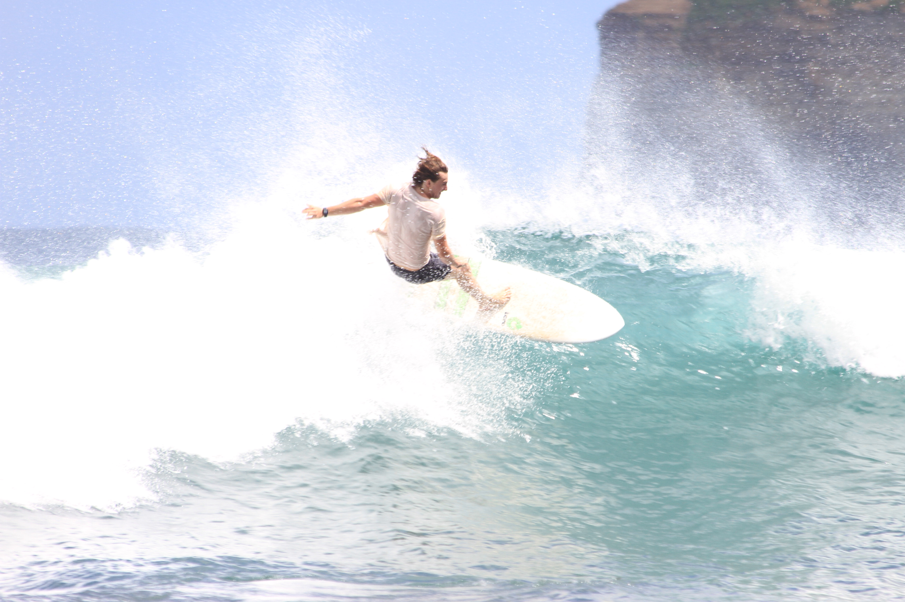
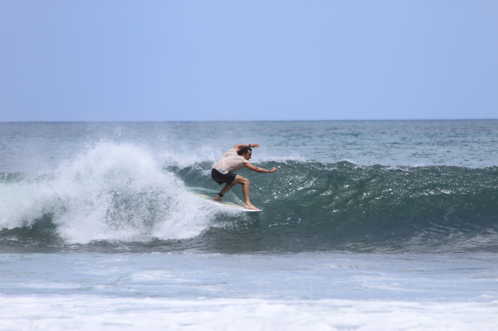
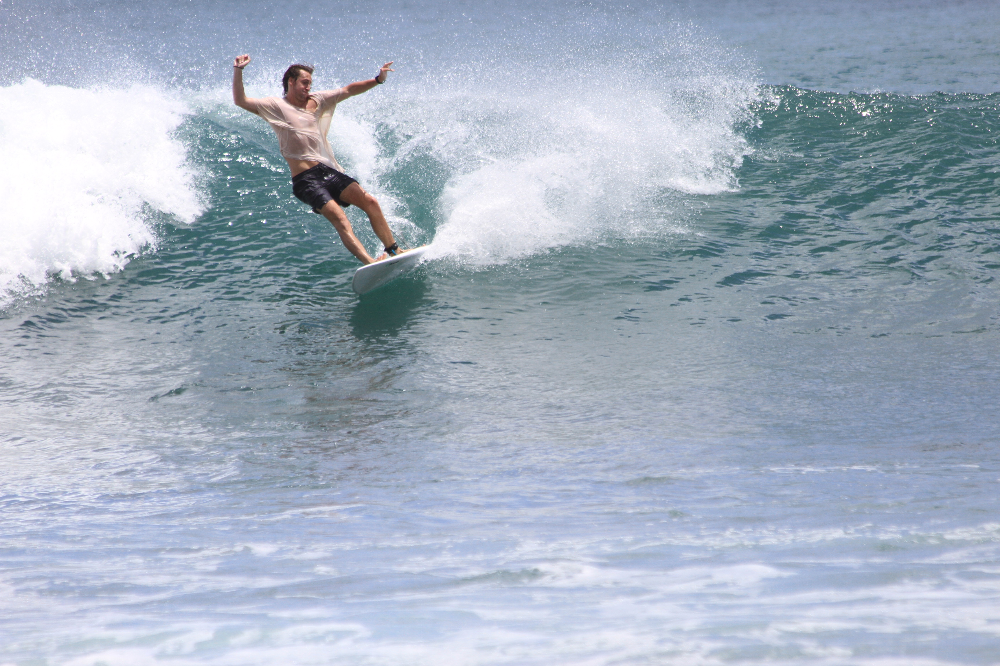
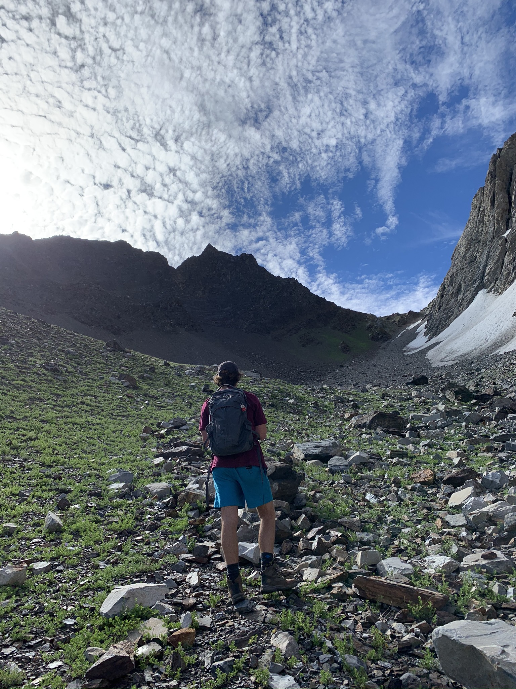
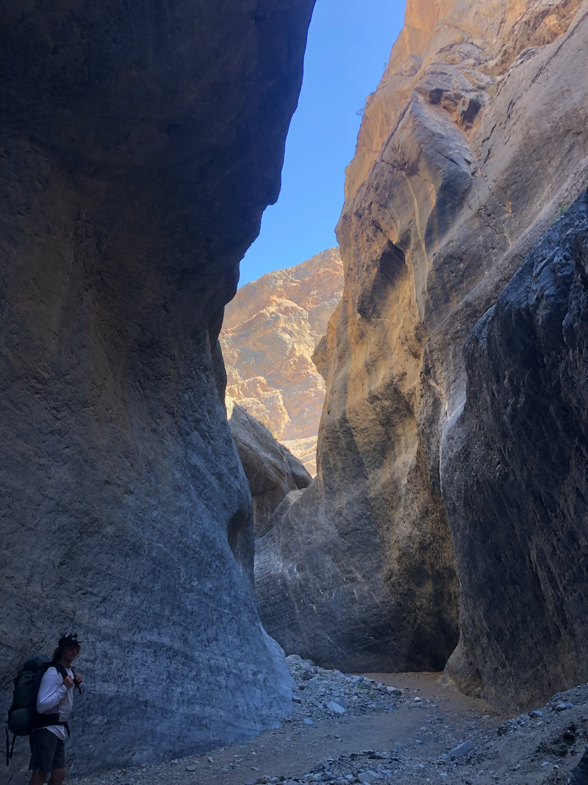
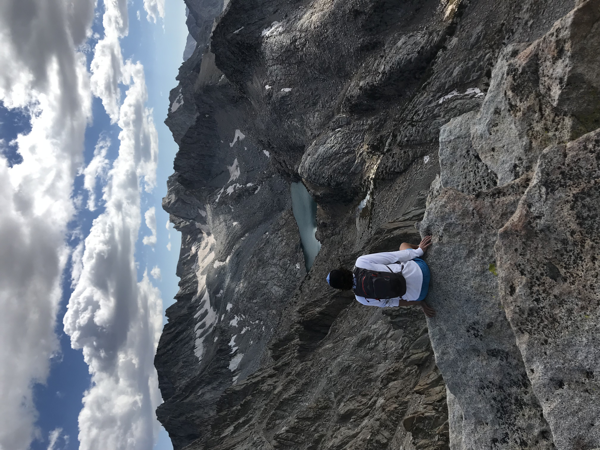
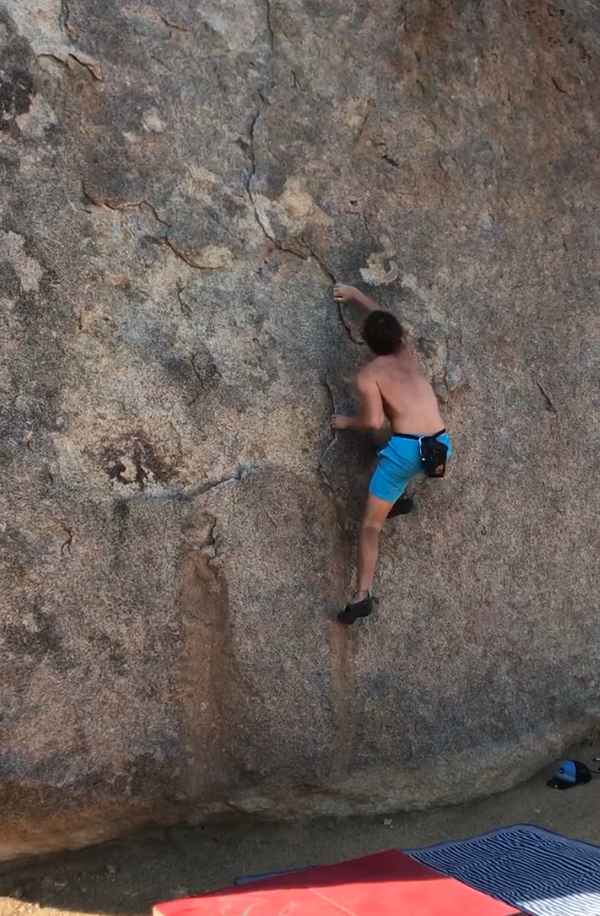

# First Response

One of my interests outside of academia is learning about first response.  It has always been a goal of mine to work as ski patrol and participate in moutain search and rescue. I've spent a considerable amount of time in the mountains, during which I've leared how quickly things can go wrong! Learning about first response started as a necessary preparatory measure to continue to engage in extreme outdoor sports, but it has turned into a significant point of interest in my life. Since encountering this newfound interest, I have become a licensed EMT and completed my Level 1 avalanche certification with [AIARE](https://avtraining.org/aiare-level-1/).  

# Surfing 

I also love to surf! No point elaborating much beyond that, but here are some pics! 

# Climbing/Hiking 

