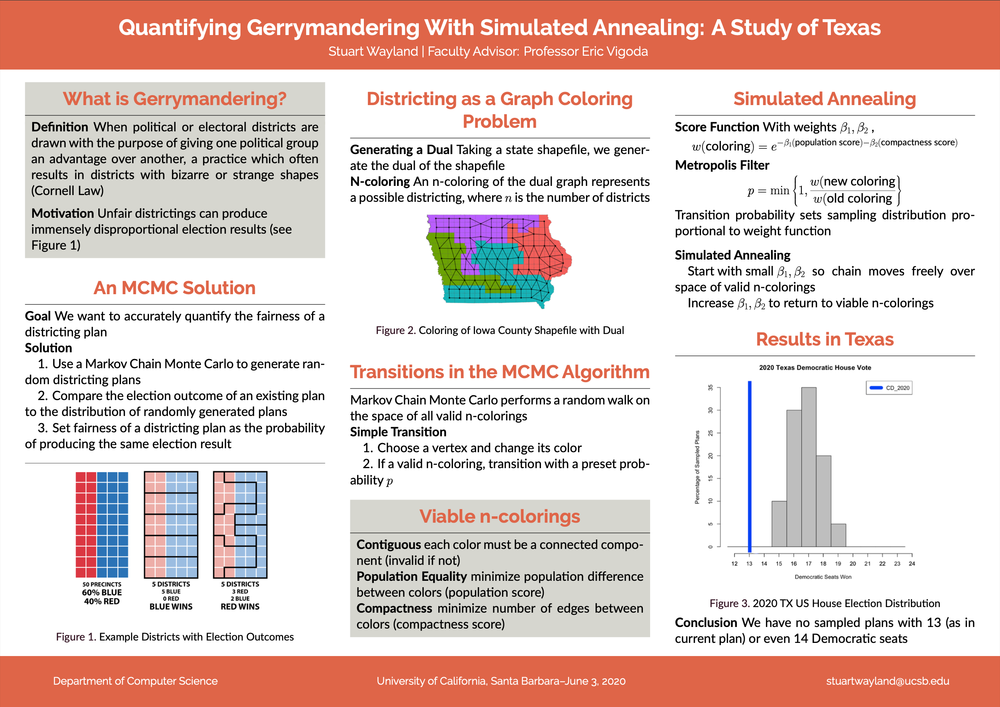

# Research

### Here at Santa Cruz

Since arriving here at UCSC, I've the pleasure of joining Professor Alexandra Kolla's Quantum Information Processing and Algorithms research group. 

### Gerrymandering Project 

Over the past yea (my senior year at UCSB), I worked closely with [Professor Eric Vigoda](https://sites.cs.ucsb.edu/~vigoda/) to complete an undergraduate thesis, titled [Quantifying Gerrymandering with Simulated Annealing](https://arxiv.org/abs/2209.00624). I joined Professor Vigoda's research group with the goal of implementing a redistricting markov chain to test Congressional districting fairness. We focused our efforts on generating a distribution of viable districting plans for the state of Texas, comparing the election results of the enacted plan to the results produced from our distribution for the 2020 US House Congressional vote. The goal was to quantify the fairness of any given districting plan, allowing for a better legal metric necessary to prove that a plan is gerrymandered. We came up with some pretty interesting results! If you want to learn more, check out the [poster](./Gerrymandering_poster.pdf) below! 

